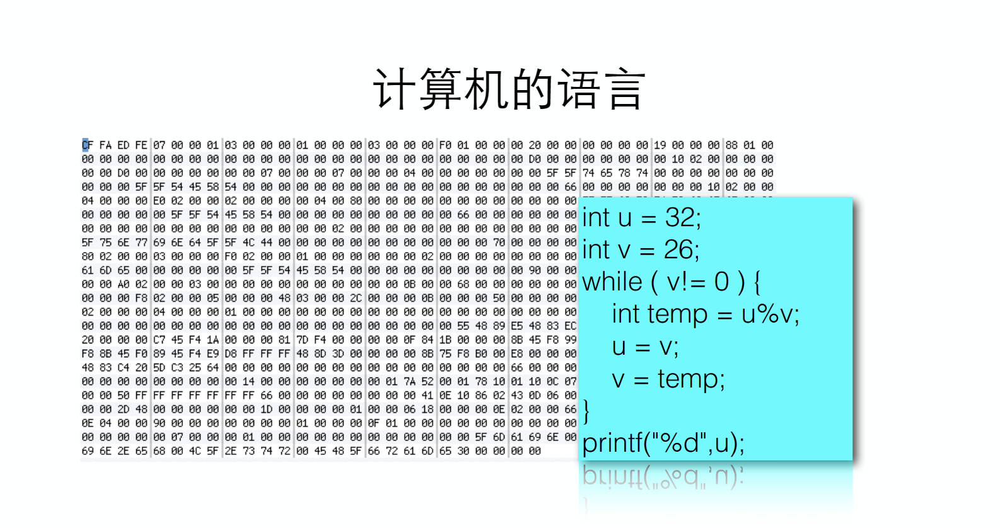

# 第一课 计算机和编程语言
## 1.计算机与编程语言：计算机怎么做事情的，编程语言是什么

### 1.计算机是生活的必需品

- 如果想要自己设计一些功能和行为，让计算机按照你的意图做事情，就需要写程序了
- 通过学习编程，来理解计算机是如何解决问题的，理解计算机的能和不能，擅长与非擅长

### 2.计算机如何解决问题
- “请给我一杯水”
  - 1.转身走到厨房
  - 2.找到一个杯子
  - 3.找到一个水壶
  - 4.在杯子中倒入一些水
  - 5.拿着杯子走回桌子
- 要对计算机说：**How to do**

### 3.计算机语言
- 程序是使用特殊的编程语言来表达如何解决问题的
- 不是用编程语言来跟计算机交谈，而是使用编程语言来告诉计算机如何解决一个问题

*你可以看到计算机内部的语言是16进制的数字 示例是下面的辗转相除法*

- 辗转相除法
```c
int u = 32;
int v = 26;
while(v != 0){
  int temp = u%v;
  u = v;
  v = temp;  
}
printf("%d", u);
```
  - 1. 如果v等于0，计算结束，u就是最大公约数
  - 2. 如果v不等于0，那么计算u除以v的余数，让u等于v，而v等于那个余数
  - 3. 回到第一步
- 我们要有算法，我们要告诉计算机一步一步的步骤 
   